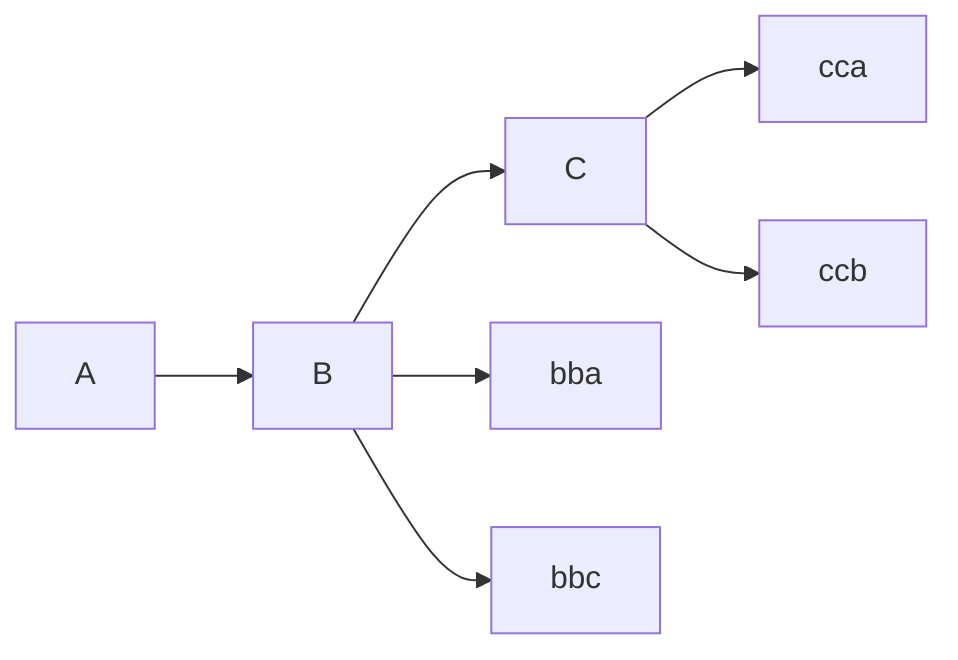
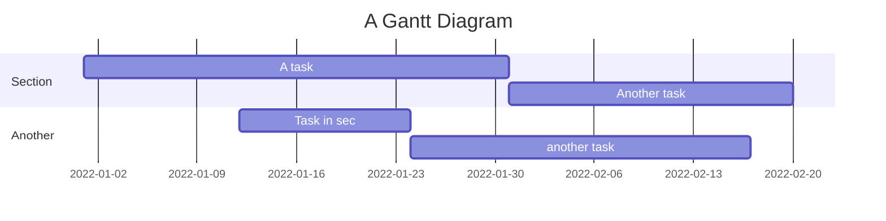

```mermaid
graph LR
A --> B
B-->C
B-->bba
B-->bbc
C-->cca
C-->ccb
```

```mermaid
gantt
 title A Gantt Diagram  
 dateFormat YYYY-MM-DD  
 section Section  
 A task :a1, 2022-01-01, 30d
 Another task :after a1, 20d
 section Another  
 Task in sec :2022-01-12, 12d  
 another task : 24d

```

```mermaid
gitGraph:
options
{
 "nodeSpacing": 150,  
 "nodeRadius": 10
}
end
commit
branch newbranch
checkout newbranch
commit
commit
checkout master
commit
commit
merge newbranch
```